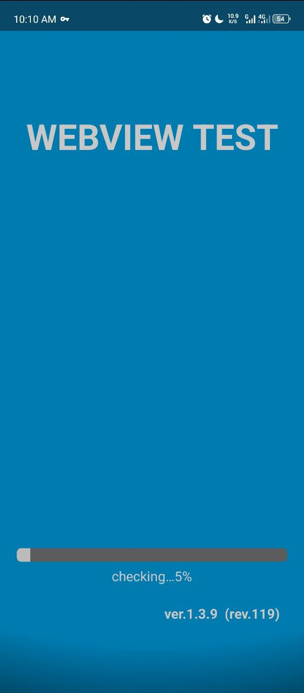
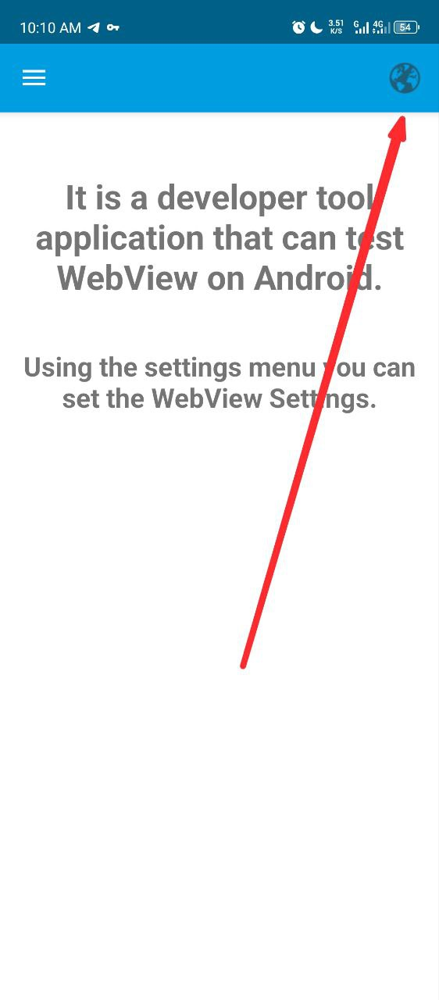
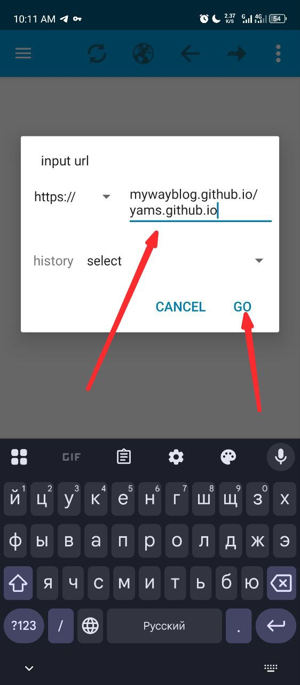
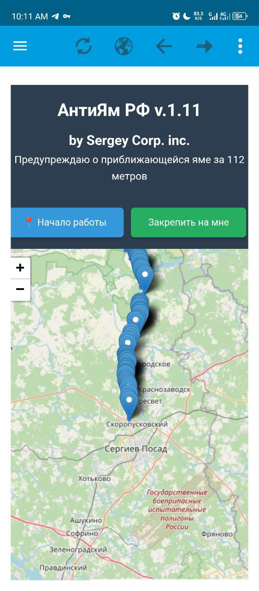
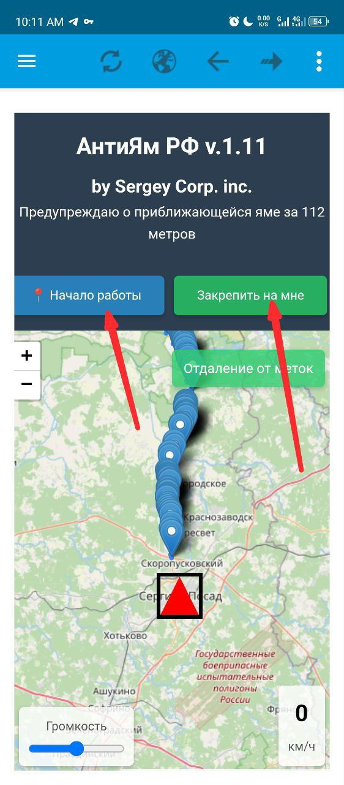
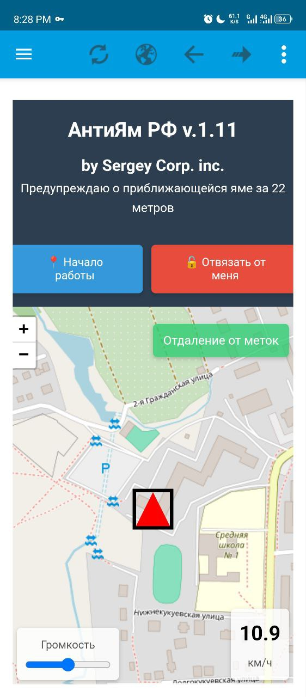

# Ямы

## Приложение
Скачайте приложение по ссылке:  

## Сайт
После установки приложения, зайдите на сайт:  
[Перейти на сайт](https://mywayblog.github.io/yams.github.io/)

---

## Инструкция по использованию

### Шаг 1
Описание первого шага.  

---

### Шаг 2
Описание второго шага.  

---

### Шаг 3
Описание третьего шага.  

---

### Шаг 4
Описание четвертого шага.  

---

### Шаг 5
Описание пятого шага.  

---

### Шаг 6
Описание шестого шага.  

